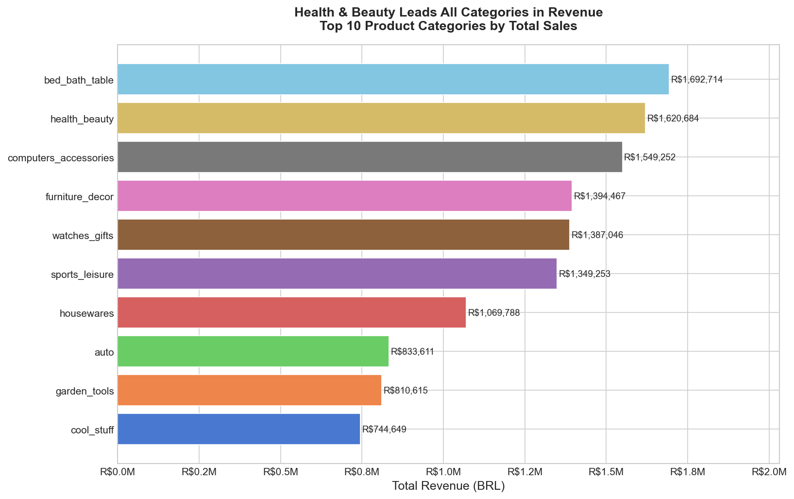
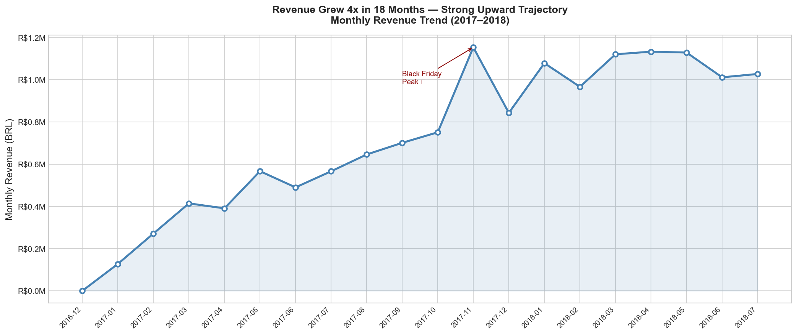
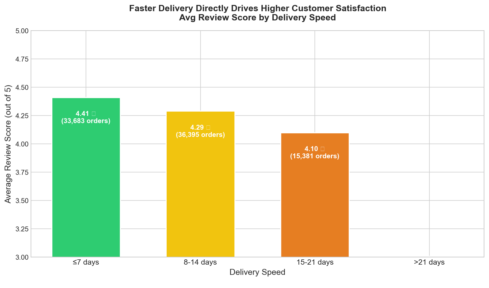
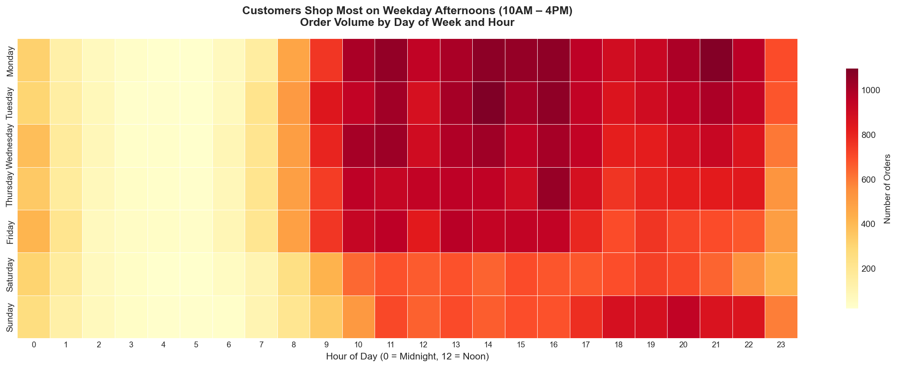
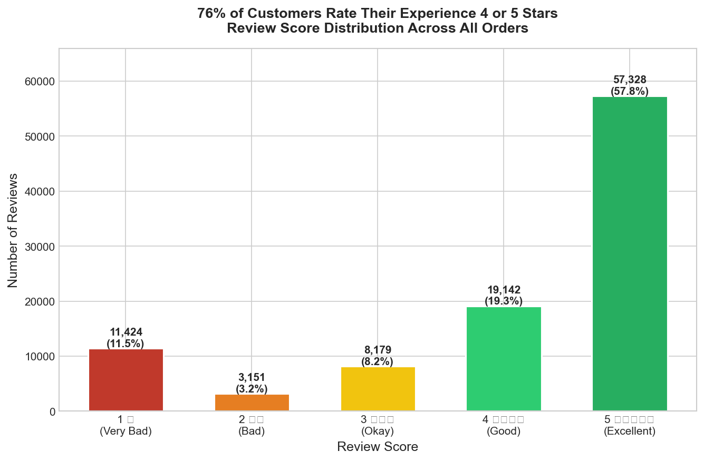
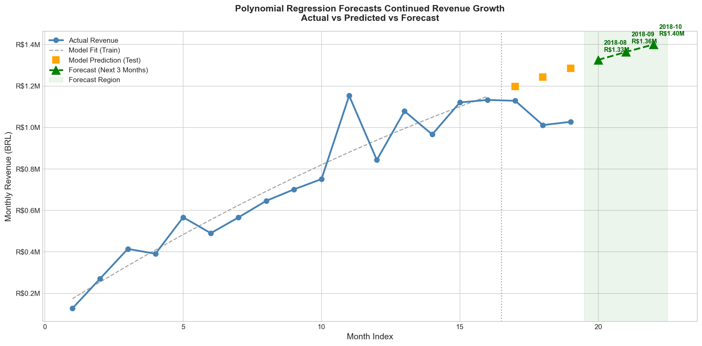

# 🛒 Customer Purchase Behavior & Sales Forecasting
### End-to-End Retail Analytics | Python · SQL · Machine Learning


---

## 📌 Overview

A full end-to-end data analytics project analyzing **96,470 real Brazilian
e-commerce orders** from the Olist platform, covering the period
**Sep 2016 – Aug 2018**.

The project simulates a real analyst brief — answering 6 business questions
across revenue, logistics, customer behavior, and forecasting — using Python,
SQL, and Machine Learning in a single Jupyter Notebook.

| | |
|---|---|
| **Dataset** | [Olist Brazilian E-Commerce — Kaggle](https://www.kaggle.com/datasets/olistbr/brazilian-ecommerce) |
| **Tools** | Python, Pandas, SQLite, Matplotlib, Seaborn, Scikit-learn |
| **Records** | 96,470 delivered orders across 7 joined tables |
| **Output** | 7 charts · 6 SQL queries · 1 ML forecast model |

---

## ❓ Business Questions Answered

1. Which product categories generate the most revenue?
2. How has monthly revenue trended over time?
3. Which states have the slowest and fastest delivery times?
4. Does faster delivery lead to higher customer review scores?
5. When do customers shop — peak days and hours?
6. Can we forecast next quarter's revenue?

---

## 🔍 Key Findings

### Revenue
- **Bed Bath Table** is the #1 revenue-generating category at **R$1,692,714**
- Revenue peaked in **November 2017** at **R$1,153,393** — driven by Black Friday
- Revenue grew **+705.5%** from January 2017 to August 2018

### Delivery & Satisfaction
- Average delivery time is **12.1 days** (median 10 days)
- Orders delivered in **≤7 days** earn an average score of **4.41 / 5.0**
- Orders taking **>21 days** drop to **3.01 / 5.0** — a **1.40 point gap**
- **São Paulo** is the fastest delivery state; **Amazonas (AM)** is the slowest at 26 days

### Customer Behaviour
- Peak shopping day: **Monday**
- Peak shopping hour: **16:00 – 17:00**
- **São Paulo** sellers generate **R$13,369,881** — dominant seller hub

### ML Forecast
- Polynomial Regression model achieves **Train R² = 0.9164**
- Forecast: **Aug 2018** → R$1,325,952 · **Sep 2018** → R$1,364,286 · **Oct 2018** → R$1,400,392
- Trend indicates continued month-on-month revenue growth

---

## 📊 Visuals

**Top 10 Revenue Categories**


**Monthly Revenue Trend (2017–2018)**


**Delivery Speed vs Customer Satisfaction**


**Order Volume Heatmap — Day & Hour**


**Review Score Distribution**


**Revenue Forecast — Next 3 Months**


---

## 📁 Project Structure
```
olist-ecommerce-analysis/
│
├── data/                        # Raw CSVs (gitignored — download from Kaggle)
├── notebooks/
│   └── olist_analysis.ipynb     # Full analysis notebook
├── visuals/                     # All exported charts (7 PNG files)
├── README.md
└── requirements.txt
```

---

## 🚀 How to Run
```bash
# 1. Clone the repository
git clone https://github.com/ErSKM/olist-ecommerce-analysis.git
cd olist-ecommerce-analysis

# 2. Install dependencies
pip install -r requirements.txt

# 3. Download dataset from Kaggle and place all CSVs in /data/
#    https://www.kaggle.com/datasets/olistbr/brazilian-ecommerce

# 4. Launch Jupyter and run the notebook top to bottom
python -m notebook
```

---

## 💡 Skills Demonstrated

| Skill | Details |
|---|---|
| Data Cleaning | Null handling, type conversion, derived columns |
| SQL | 6 business queries using joins, aggregations, window functions |
| EDA | 7 professional visualizations with business narrative |
| Machine Learning | Polynomial Regression with train/test split and evaluation |
| Storytelling | Findings framed as business insights, not just numbers |

---

## 👤 Author

**Salahuddin K M** — Data Analyst
[Portfolio](https://erskm.github.io) · [GitHub](https://github.com/ErSKM)
